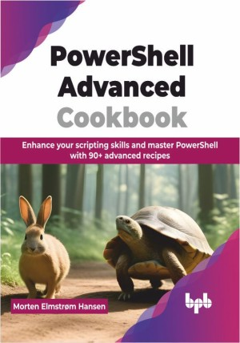

# PowerShell Advanced Cookbook

Fully unleash your scripting powers and capabilities with PowerShell 

This is the repository for [PowerShell Advanced Cookbook
](https://bpbonline.com/products/powershell-advanced-cookbook),published by BPB Publications.

## About the Book
PowerShell is a powerful scripting language, automation framework and command-line shell developed by Microsoft that is built on the .NET framework. It is an essential tool because it allows system administrators and developers to automate and optimize complex administrative tasks across multiple systems efficiently. PowerShell's deep integration with Windows and other Microsoft products makes it an invaluable tool for administrating, managing and optimizing Windows environments.

Designed as a cookbook, this book enables readers to expand and build upon their current PowerShell knowledge and skillset. Topics covered in detail include creating PowerShell unit tests using Pester, managing and administrating Azure and AWS cloud services, remote script execution, Active Directory management, PowerShell desired state configuration and more. Each chapter includes recipes that delves into the topics, accompanied by code examples and walkthroughs. 

After reading this book, readers would have gained the knowledge and skills that will enable them to build better and more advanced scripts and applications while also understanding key principles of automation and optimization. This will also aid the readers to streamline processes and enhance administrative tasks more efficiently using PowerShell.

## What You Will Learn
• Develop advanced PowerShell functions, classes, and scripts with sophisticated flow control.

• Manage errors effectively, including custom error classes, in scripts and background jobs.

• Securely handle remote sessions using PowerShell remoting for enhanced management.

• Utilize Pester for unit testing and mocking dependencies, ensuring script reliability.

• Administer Active Directory objects and cloud services like Azure and AWS, including Microsoft 365 applications.

• Build GUI applications and Windows services from PowerShell scripts with SAPIEN PowerShell studio IDE. 
